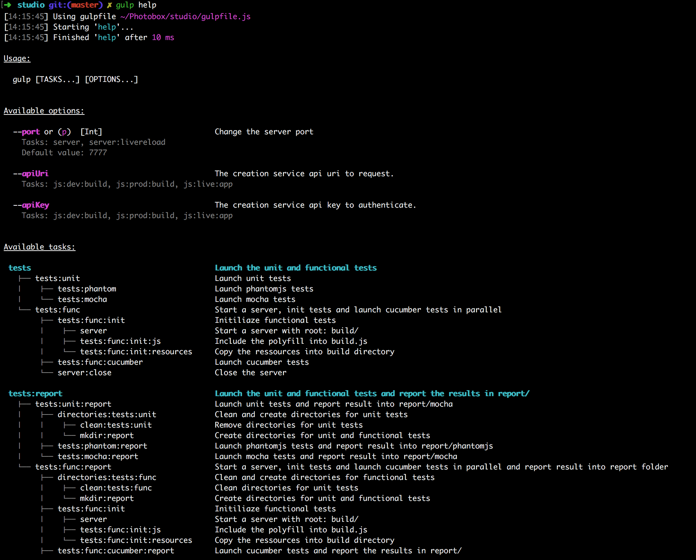

# [gulp](https://github.com/gulpjs/gulp)-help-tasks-tree [![NPM version][npm-image]][npm-url]
Display help with options and tasks tree.   
gulp-help-tasks-tree will parse your gulp files to find every tasks and dependencies, then it will create and display the tasks tree.



## Install

```bash
$ npm install --save-dev gulp-help-tasks-tree
```

## Usage

Add a task in your gulpfile and pass every gulp files to src.

```js
// gulpfile.js
var gulp = require('gulp');
var help = require('gulp-help-tasks-tree');

gulp.task('help', function () {
    gulp.src('gulpfile.js')
        .pipe(help({
            tasks: gulp.tasks,
            description: {
                'help': 'Display help and tasks tree'
            }
        }));
    });
```

## Options

#### tasks
Pass the `gulp.tasks` to the gulp-help-tasks-tree.   
Without the tasks, the plugin will not find the dependencies.
```js
opts.tasks = gulp.tasks
```

#### description
Description is a simple key/value object ({ task: description}):
```js
opts.description = {
    taskName1: 'description of the tasks name 1',
    taskName2: 'description of the tasks name 2',
};
```

#### options
Options is an array of objects.  
Each object defines an option with the following properties :    

| key        | type           | description  | required |
| ---------- | -------------- | ------------ | -------- |
| **name** | string | name of the option | true |
| **description** | string | description of the option | false |
| **tasks** | string or array | task taking the option | false |
| **default** | string | default value | false |
| **alias** | string | alias | false |
| **type** | string or array | type of the option | false |
| **values** | string or array | possible values of the option | false |

```js
opts.options = [
    {
        name: 'name',
        description: 'Description of your option 1',
        tasks: ['html:index', 'js:build'],
        default: 'value',
        alias: 'n',
        type: 'String',
        values: ['dev', 'prod']
    }
];
```


[npm-url]: https://npmjs.org/package/gulp-help-tasks-tree
[npm-image]: http://img.shields.io/npm/v/gulp-help-tasks-tree.svg
